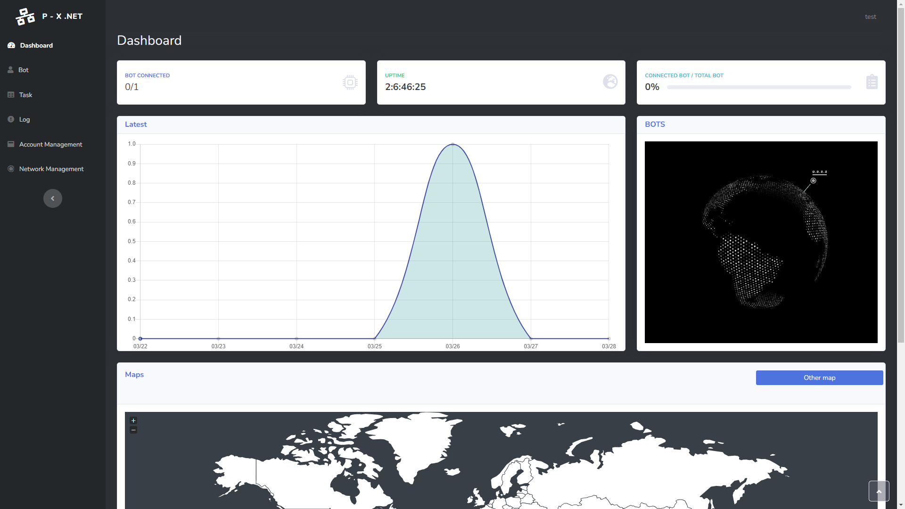

<h1 align="center">
	P&X - BOTNET
</h1>

<p align="center">
	<b><i>Development repo for educational purpose only !</i></b><br>
</p>

<p align="center">
	
	
	
	
	
</p>

---
## Setup :

sudo apt install -y libssh-dev

## Usage :
./px_botnet

## Demo :


## Tools :
 > - [Makefile](https://github.com/PandeoF1/makefile) <br />

## (づ｡◕‿‿◕｡)づ :
```
 ██▓███        ▒██   ██▒
▓██░  ██▒      ▒▒ █ █ ▒░
▓██░ ██▓▒      ░░  █   ░
▒██▄█▓▒ ▒       ░ █ █ ▒ 
▒██▒ ░  ░      ▒██▒ ▒██▒
▒▓▒░ ░  ░      ▒▒ ░ ░▓ ░
░▒ ░           ░░   ░▒ ░
░░              ░    ░  
                ░    ░  
```